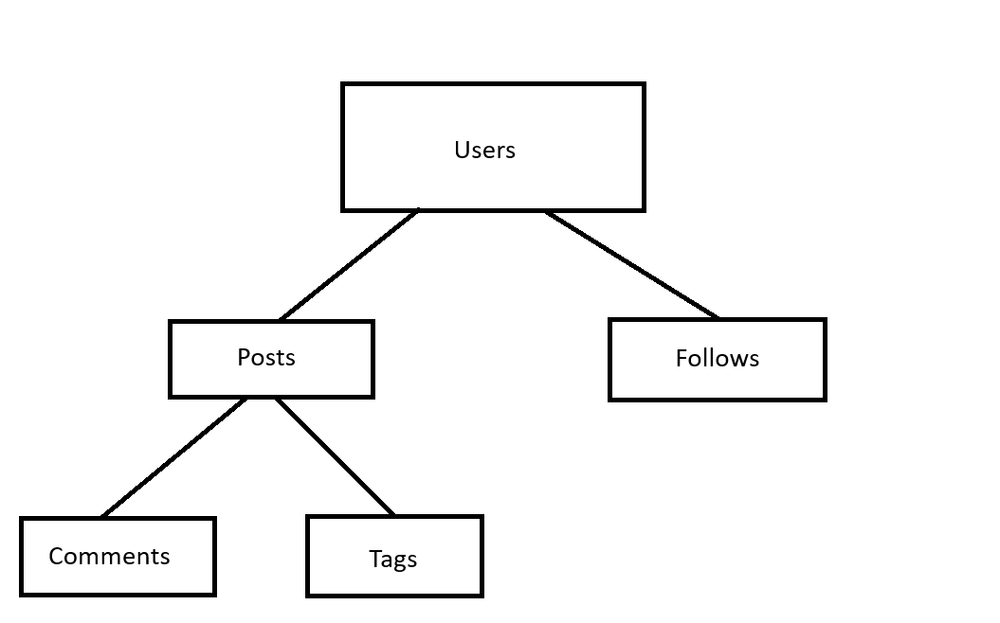

1. Các resources trong miền:
    - Users: 
            POST /users
            GET /users/<user_id>
            PATCH /users/<user_id>
    - Post:
            POST /users/<user_id>/posts
            GET /users/<user_id>/posts
            PATCH /users/<user_id>/posts/<post_id>
            DELETE /users/<user_id>/posts/<post_id>
    - Comments:
            GET /users/<user_id>/posts/<post_id>/comments
            POST /users/<user_id>/posts/<post_id>/comments
    - Tags:
            GET /users/<user_id>/posts/<post_id>/tags
            POST /users/<user_id>/posts/<post_id>/tags
    - Follows:
            GET /users/<user_id>/following
            GET /users/<user_id>/followers
            POST /users/<user_id>/following/<target_user_id>
2. Phân loại Collection/Item/Sub-resources:
    - Collection: Users, Posts
    - Item: Users, Posts với id cụ thể
    - Sub-resource: Comments, Tags, Follows
3. Cây sơ đồ endpoints và version segment
                                

    - Version segment: v1, nằm ở đầu URL, trước Resource, vd: /v1/users/<user_id>