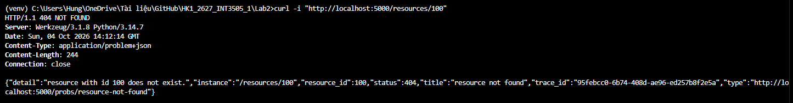
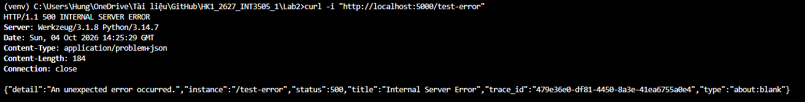

- Request tới /resources/<id> trả 404
- Body có đủ type, title, status, instance, detail
- Có thiếu Accept hoặc client Accept JSON vẫn trả problem+json cho lỗi API
- Nếu có Exception chưa bắt thì vẫn trả mã 500 với message trung tính và log chi tiết bên server

